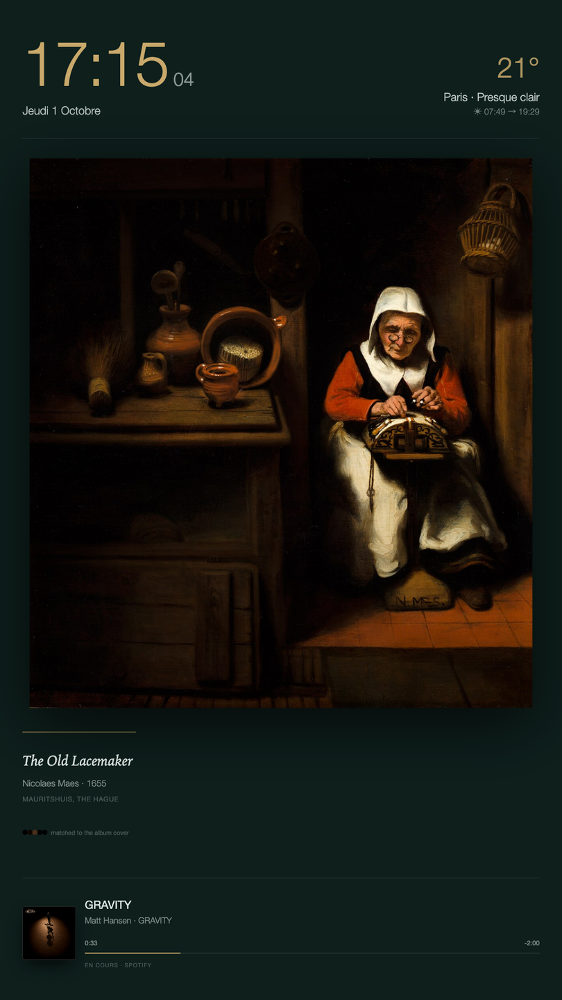
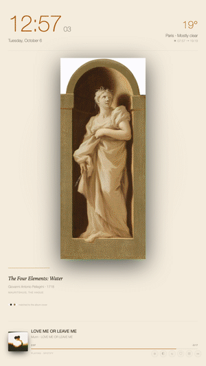
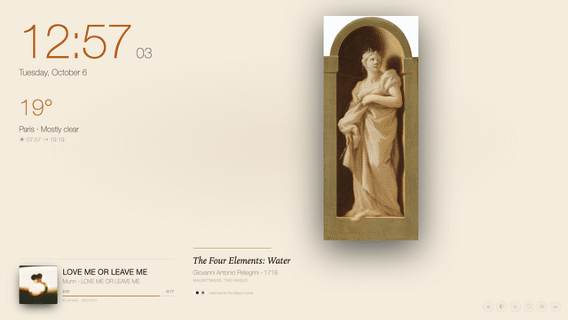
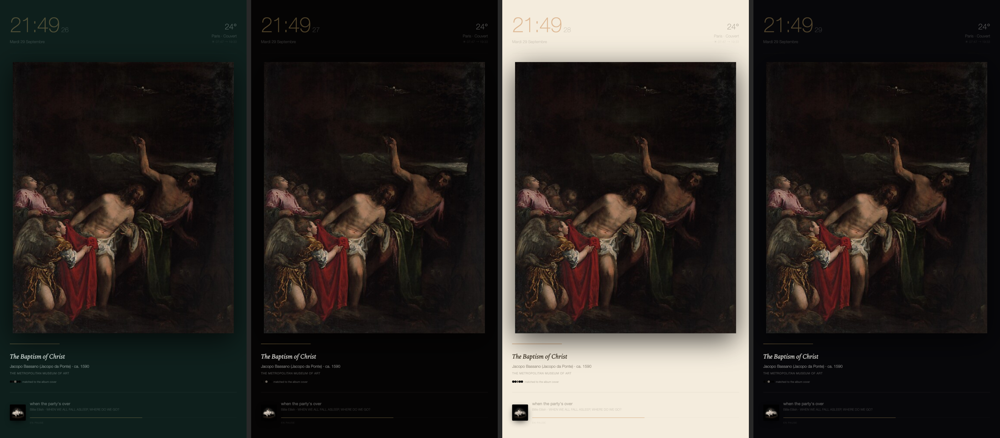
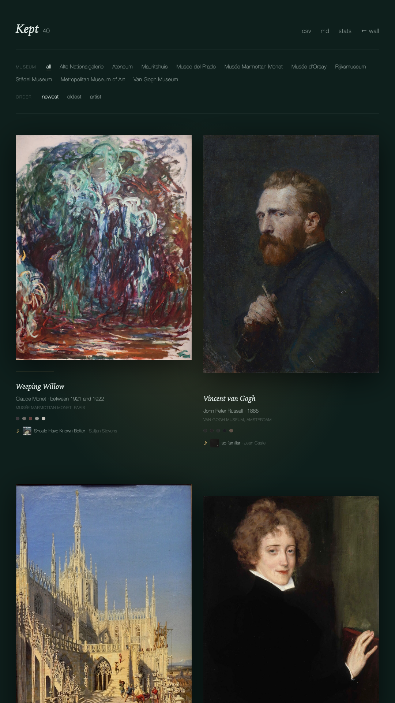

# heure bleue

A gallery wall for a spare screen. One painting at a time, from open museum
collections, chosen to match the colours of whatever you are listening to.

**[Try the web demo](https://zoha-rakotomalala.github.io/heure-bleue/)** — the
wall without the music match. Press `F` for fullscreen, `N` for another painting.





*Four minutes on a Wednesday afternoon, in eight seconds: each new song brings a painting in the cover's colours. Recorded from the running app with `tools/record_demo.js` and `tools/assemble_demo.py`.*



*On a landscape screen the clock, weather and music sit on the left and the painting takes the full height on the right.*

- **Paintings** from The Met, the Rijksmuseum and the Musée d'Orsay. 420 public-domain works ship in the index; the indexer can fetch more.
- **Music** from Spotify or Apple Music on macOS, any player on Windows (system media session) and Linux (MPRIS). The album cover's palette picks the painting.
- **A quiet board**: clock, date, weather, sunrise and sunset, a *heure bleue* countdown. Nothing from work.
- **It learns**: keep a painting (♥) and the wall leans toward that artist, museum and century.
- **Themes**: forest, heure bleue, night, charcoal, plum, oxblood, paper, linen, any hex, or a wall that follows the painting.



Everything runs on your machine, on `127.0.0.1`. No accounts, no API keys, no
telemetry. The only network calls are museum images, Open-Meteo for weather, and
the Spotify cover CDN.

## Install

Python 3.10 or newer.

```sh
git clone https://github.com/zoha-rakotomalala/heure-bleue.git
cd heure-bleue
python3 -m pip install -r requirements.txt
python3 -m heurebleue doctor      # checks Python, Pillow, your player, the index, the port
python3 -m heurebleue start --open
```

Then put the browser window on the spare screen and press `F` for fullscreen.
On macOS, Safari → File → *Add to Dock* gives you a clean web app with no
address bar. Chrome: *Save and share → Install page as app*.

Start at login:

```sh
python3 -m heurebleue service install    # launchd / Task Scheduler / systemd --user
python3 -m heurebleue service remove
```

### Windows

Install the media-session bridge so the wall can see your player:

```sh
py -m pip install winsdk
```

`winsdk` supports Python 3.9–3.12. On 3.13 use the `winrt-*` packages instead
(`pip install winrt-runtime winrt-Windows.Media.Control winrt-Windows.Storage.Streams`).
Anything that shows in the Windows media overlay works: Spotify, Apple Music,
iTunes, a browser tab.

### Linux

```sh
sudo apt install playerctl      # or dnf / pacman
```

Any MPRIS player works.

## Keys and buttons

Small buttons sit bottom-right and fade after 4 s of stillness. The ⏭ button
appears only while music plays.

| key | action |
|---|---|
| `F` | fullscreen |
| `N`, `space`, `→` | another painting |
| `>` or `.` | next song in the player; the wall follows at once |
| `L` | keep this painting (♥). The song playing is remembered with it |
| `K` | open *Kept*, your favorites |
| `S` | open *Stats* |
| `T` | wall colour |
| `Esc` | close |



## Configure

Create `config.json` next to this README. Any key you omit keeps its default.

```json
{
  "port": 8765,
  "theme": "forest",
  "locale": "en-GB",
  "city": { "name": "Amsterdam", "lat": 52.3676, "lon": 4.9041, "timezone": "Europe/Amsterdam" },
  "poll_seconds": 5,
  "min_dwell_seconds": 45,
  "rotate_minutes": 4,
  "paused_rotate_minutes": 20
}
```

Themes can also be set from the URL: `?theme=night`, `?theme=painting`, `?bg=1f2a1c`.
The choice is remembered per browser.

## The index

`data/paintings.json` holds title, artist, date, museum, image URL and a
five-colour palette for each work. About 500 bytes per painting, no images on
disk. To add more:

```sh
python3 -m heurebleue index --target 800            # every source, round-robin
python3 -m heurebleue index --source louvre --target 600   # one museum (met, rijks, or a Commons slug)
python3 -m heurebleue index --source commons --target 600  # all the Wikimedia Commons museums
python3 -m heurebleue stories                        # curator texts for Rijksmuseum entries
```

The indexer is deliberately slow (0.8 s between requests, backs off on 429) so it
stays a good citizen of free museum APIs. Photos that include a photographic
calibration strip are detected and skipped. Only public-domain images are kept.

## How the match works

The album cover is reduced to five colours. Each painting in the index already
has five. The distance between two palettes is a weighted nearest-colour sum in
CIELAB, both ways. Favorites shorten the distance for artists, museums and
centuries you keep. The painting changes when the song changes, never sooner
than `min_dwell_seconds` after the last change, so skipping tracks does not make
the wall flicker. When no player is open, the wall rotates every `rotate_minutes`. A paused
player holds the painting, until it has been paused for `paused_rotate_minutes`;
then the wall rotates again until you press play.

## Web demo

`python3 -m heurebleue demo` builds a static copy of the wall in `site/`: the two
pages, the shipped index, and `web/demo.js`, which answers the `/api/*` routes in
the browser. Favourites and taste live in `localStorage`. There is no player loop
in a browser, so there is no music match: the wall rotates on its own.

The `pages` workflow builds and publishes it to GitHub Pages on every push to
`main`. One-time setup in the repo: *Settings → Pages → Source: GitHub Actions*.

Preview locally: `python3 -m http.server 8766 --bind 127.0.0.1 --directory site`.

## Data written at runtime

All under `data/`, all git-ignored except the index:

`now_playing.json` (current state) · `favorites.json` · `taste.json` (weights
derived from favorites) · `history.jsonl` (one line per painting shown, with
dwell time and the song) · `cover.jpg` (when the player gives raw artwork).

## Credits

Images and metadata: [The Metropolitan Museum of Art](https://www.metmuseum.org/art/collection) (CC0),
[Rijksmuseum](https://data.rijksmuseum.nl/) (CC0), and Wikimedia Commons uploads of
public-domain works in the [Musée d'Orsay](https://commons.wikimedia.org/wiki/Category:Paintings_in_the_Mus%C3%A9e_d%27Orsay).
Weather: [Open-Meteo](https://open-meteo.com/).

MIT licence.
