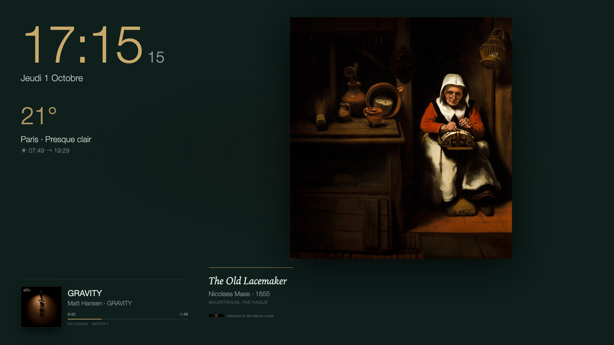
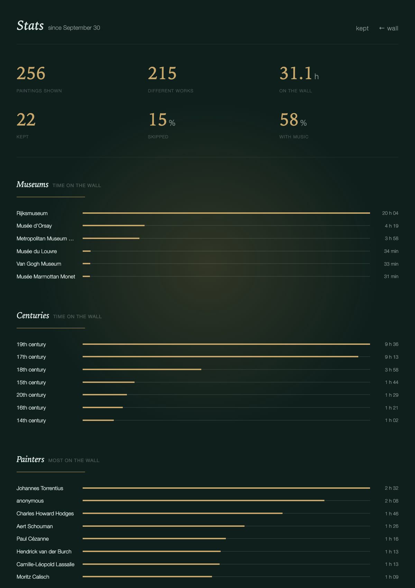

# heure bleue

A gallery wall for a spare screen. One painting at a time, from the open
collections of seventeen museums, chosen to match the colours of the music you
are playing.

**[Try the web demo](https://zoha-rakotomalala.github.io/heure-bleue/)** — the
wall without the music match. Press `F` for fullscreen, `N` for another painting.

<p align="center">
  
</p>

<p align="center">
  
</p>

*Four minutes on a Wednesday afternoon, in eight seconds. Each new song brings a
painting in the colours of its cover.*

## What it does

- **Follows your music.** When a song starts, the album cover is reduced to five
  colours and the closest painting comes up. Spotify or Apple Music on macOS;
  any player on Windows and Linux.
- **Rotates on its own** every few minutes when nothing is playing.
- **Keeps a quiet board**: clock, date, weather, sunrise and sunset. Nothing from work.
- **Learns what you like.** Keep a painting (♥) and the wall leans toward that
  painter, museum and century. The song playing is remembered with it.
- **Keeps a diary.** A *Kept* page for your favourites and a *Stats* page: time
  on the wall by museum, century and painter, and which music brought which painters.

Everything runs on your machine, on `127.0.0.1`. No accounts, no API keys, no
telemetry. The only network calls are museum images, Open-Meteo for weather, and
the album cover.

## Install

You need Python 3.10 or newer and a browser. Pick your system.

### macOS

```sh
git clone https://github.com/zoha-rakotomalala/heure-bleue.git
cd heure-bleue
python3 -m pip install -r requirements.txt
python3 -m heurebleue start --open
```

The wall opens in your browser. Move the window to the spare screen and press
`F` for fullscreen. For a clean window with no address bar: in Safari, *File →
Add to Dock*, then open the wall from the Dock.

Music is read from Spotify or Apple Music. Nothing else to install.

To start the wall at login and keep it running in the background:

```sh
python3 -m heurebleue service install
```

### Windows

Open PowerShell or Terminal:

```powershell
git clone https://github.com/zoha-rakotomalala/heure-bleue.git
cd heure-bleue
py -m pip install -r requirements.txt
py -m pip install winsdk
py -m heurebleue start --open
```

`winsdk` lets the wall read the Windows media session, so any player that shows
in the volume overlay works (Spotify, Apple Music, a browser tab). On Python
3.13, install `winrt-runtime winrt-Windows.Media.Control
winrt-Windows.Storage.Streams` instead of `winsdk`.

To start the wall at login (creates a Task Scheduler task named *HeureBleue*):

```powershell
py -m heurebleue service install
```

### Linux

```sh
sudo apt install playerctl        # or: dnf install playerctl / pacman -S playerctl
git clone https://github.com/zoha-rakotomalala/heure-bleue.git
cd heure-bleue
python3 -m pip install -r requirements.txt
python3 -m heurebleue start --open
```

`playerctl` lets the wall read any MPRIS player (Spotify, VLC, a browser).

To start the wall at login (creates a `systemd --user` service):

```sh
python3 -m heurebleue service install
```

### Check the setup

On any system, `heurebleue doctor` tells you what is missing:

```sh
python3 -m heurebleue doctor      # Windows: py -m heurebleue doctor
```

It checks Python, Pillow, your music player, the painting index and the port.
To remove the login service later: `python3 -m heurebleue service remove`.

## On a landscape screen

<p align="center">
  
</p>

The clock, weather and music move to the left; the painting takes the full
height on the right. The layout follows the screen, nothing to configure.

## Keys

Small buttons sit bottom-right and fade when the mouse is still.

| key | |
|---|---|
| `F` | fullscreen |
| `N` · `space` · `→` | another painting |
| `>` · `.` | next song, the wall follows at once |
| `L` | keep this painting ♥ |
| `K` | *Kept*, your favourites |
| `S` | *Stats* |
| `T` | wall colour |
| `G` | language, place, units |

<p align="center">
  
  &nbsp;&nbsp;
  
</p>

## Wall colours

Forest, heure bleue, night, charcoal, plum, oxblood, paper, linen, or a wall
that takes its colour from the painting. Press `T`, or add `?theme=night` to the
URL. The choice is remembered per browser.


## Language, place, units

Press `G`, or the ⚙ button. The wall speaks English, French, Dutch, German,
Spanish, Italian, Portuguese, Finnish, Swedish, Danish, Polish, Russian and
Japanese: every label, the weather, the sun line, the Kept and Stats pages. The
date follows the language too. Add `?lang=de` to the URL to pick one from the
address bar.

The same panel sets the place for the weather and the sun times: search a city
(Open-Meteo geocoding, no key) or use the browser's position. Temperatures in
°C or °F. All three choices are remembered per browser; *reset* goes back to
`config.json`.

Rijksmuseum texts about a painting exist in Dutch and English; the wall shows the
Dutch original to Dutch readers and the English text to everyone else.

## The paintings

1,121 public-domain works ship with the app, about 500 bytes each, no images on
disk. Rijksmuseum 300 · Musée d'Orsay 125 · The Met 101 · Van Gogh Museum 90 ·
Mauritshuis 67 · Louvre 41 · Belvedere, Ateneum, Prado, Kunsthistorisches
Museum, Gemäldegalerie, Hermitage, Neue Pinakothek, Alte Nationalgalerie,
Marmottan Monet, National Gallery London 35–40 each · Städel 20. Rijksmuseum
works carry the museum's own text about the painting, shown under the label.

To add more:

```sh
python3 -m heurebleue index --target 1500               # every museum, round-robin
python3 -m heurebleue index --source prado --target 1200  # one museum
```

The indexer is slow on purpose (a pause between requests, back-off on 429) so it
stays a good citizen of free museum APIs. Only public-domain images are kept;
`--allow-cc` also keeps CC-licensed photos in a local, git-ignored file for your
own screen.

<details>
<summary>Settings</summary>

Create `config.json` next to this README. Any key you omit keeps its default.

```json
{
  "port": 8765,
  "theme": "forest",
  "locale": "en-GB",
  "language": "",
  "units": "celsius",
  "city": { "name": "Amsterdam", "lat": 52.3676, "lon": 4.9041, "timezone": "Europe/Amsterdam" },
  "min_dwell_seconds": 45,
  "rotate_minutes": 4,
  "paused_rotate_minutes": 20,
  "repeat_days": 3
}
```

`min_dwell_seconds` stops the wall flickering when you skip tracks.
`rotate_minutes` is the pace with no music. A paused player holds the painting
for `paused_rotate_minutes`, then the wall rotates until you press play.
`repeat_days` keeps a painting off the wall for that long after it has been shown.
`locale` is the regional date format; `language` picks the words on screen and,
left empty, follows the locale. `units` is `celsius` or `fahrenheit`. A choice
made in the ⚙ panel wins over these three in that browser.
</details>

<details>
<summary>How the match works</summary>

Each painting in the index has a five-colour palette. The album cover is reduced
to five colours too. The distance between two palettes is a weighted
nearest-colour sum in CIELAB, both ways. Your favourites shorten the distance for
painters, museums and centuries you keep; recent showings lengthen it. The pick
is a weighted draw among the twelve closest, so the same cover does not always
give the same painting.
</details>

<details>
<summary>Web demo, data files, recording a demo</summary>

**Web demo.** `python3 -m heurebleue demo` builds a static copy in `site/`.
Favourites live in `localStorage`; there is no player loop in a browser, so the
wall rotates on its own. The `pages` workflow publishes it to GitHub Pages on
every push to `main`.

**Data written at runtime**, all under `data/` and git-ignored except the index:
`now_playing.json`, `favorites.json`, `taste.json`, `history.jsonl` (one line per
painting shown, with dwell time and song), `cover.jpg`.

**Demo recordings.** `tools/record_demo.js` opens the running wall as a second
viewer and saves a frame every few seconds; `tools/assemble_demo.py` turns the
frames into a GIF. `tools/shoot_docs.js` takes the screenshots on this page.
</details>

## Credits

Images and metadata: [The Metropolitan Museum of Art](https://www.metmuseum.org/art/collection) (CC0),
the [Rijksmuseum](https://data.rijksmuseum.nl/) (CC0), and
[Wikimedia Commons](https://commons.wikimedia.org/) uploads of public-domain works
from fifteen other museums. Weather: [Open-Meteo](https://open-meteo.com/).

MIT licence.
