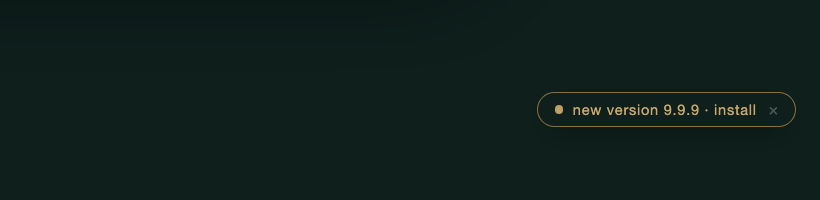
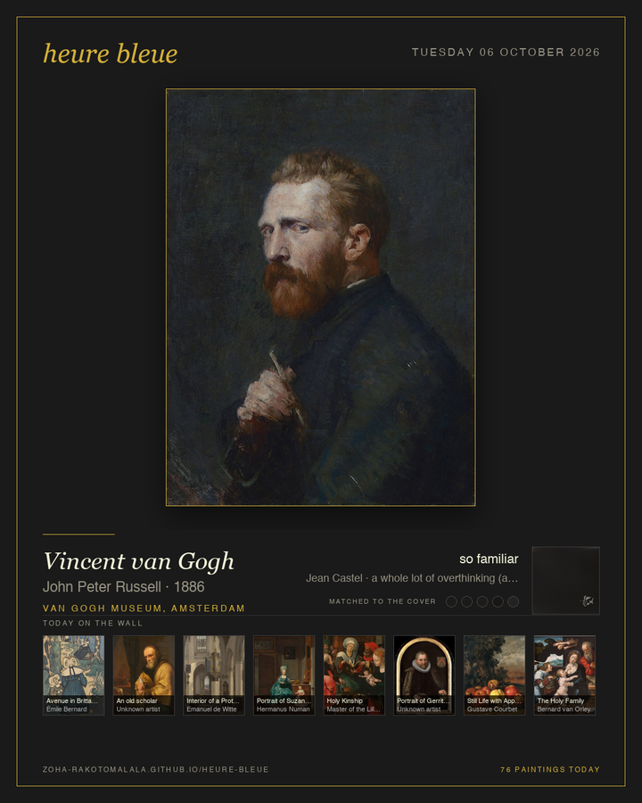
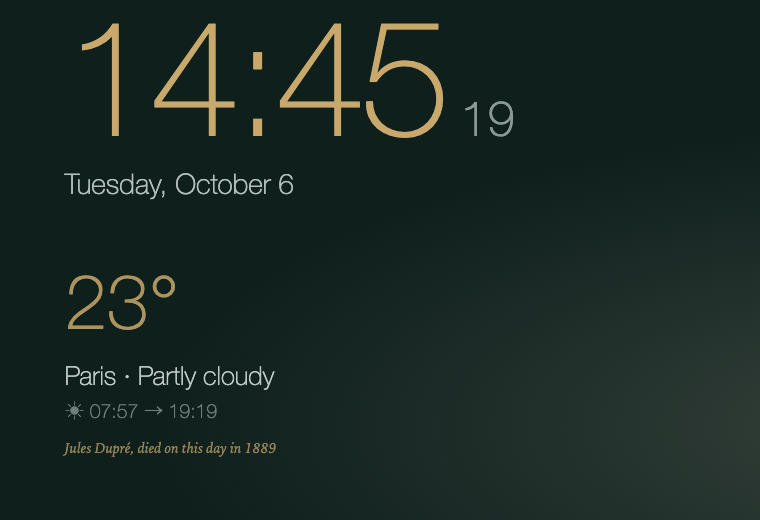
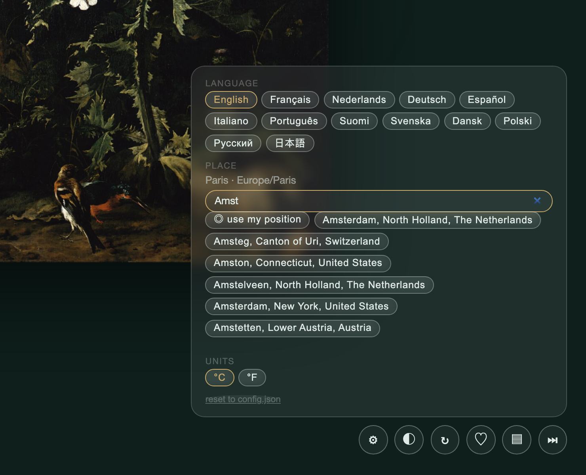

# heure bleue

A gallery wall for a spare screen. One painting at a time, from the open
collections of seventeen museums, chosen to match the colours of the music you
are playing.

**[Try the web demo](https://zoha-rakotomalala.github.io/heure-bleue/)** — the
wall without the music match. Press `F` for fullscreen, `N` for another painting.

<p align="center">
  
</p>

<p align="center">
  
</p>

*Seven minutes of a Tuesday, in nine seconds: a song is skipped every fifty
seconds and the wall follows, one painting per song, in the colours of its cover.*

## What it does

- **Follows your music.** When a song starts, the album cover is reduced to five
  colours and the closest painting comes up. Spotify and Apple Music on macOS,
  plus YouTube Music, Deezer, TIDAL or a browser tab (the Mac app ships
  `media-control` for those); any player on Windows and Linux.
- **Rotates on its own** every few minutes when nothing is playing.
- **Keeps a quiet board**: clock, date, weather, sunrise and sunset. Nothing from work.
- **Learns what you like**, or not: keep a painting (♥) and the wall leans toward
  that painter, museum and century. *Surprise me* turns the lean off.
- **Makes a card** of the wall right now (`P`), for sending to someone.
- **Knows the calendar**: on a painter's birthday, a line says so.
- **Keeps a diary.** A *Kept* page for your favourites and a *Stats* page.
- **Updates itself**, one click, signed releases.

Everything runs on your machine, on `127.0.0.1`. No accounts, no API keys, no
telemetry. The only network calls are museum images, Open-Meteo for weather, the
album cover, and one request a day to GitHub to see whether a newer version exists
(`"update_check": false` in `config.json` turns that off).

## Install

Free, for Mac, Windows and Linux. One click per system; each link always gives
the newest version:

| | Download |
|---|---|
| Mac with Apple silicon (M1 and later) | [HeureBleue mac-arm64.dmg](https://zoha-rakotomalala.github.io/heure-bleue/get/?os=mac-arm64) |
| Mac with an Intel chip | [HeureBleue mac-intel.dmg](https://zoha-rakotomalala.github.io/heure-bleue/get/?os=mac-intel) |
| Windows 10 or 11 | [HeureBleue windows-x64.zip](https://zoha-rakotomalala.github.io/heure-bleue/get/?os=windows) |
| Linux (x86-64, glibc 2.35+: Ubuntu 22.04 and newer, Fedora, Arch) | [HeureBleue linux-x64.tar.gz](https://zoha-rakotomalala.github.io/heure-bleue/get/?os=linux) |

The links go through [`get/`](https://zoha-rakotomalala.github.io/heure-bleue/get/),
which asks GitHub for the latest release and sends you to the file. All files,
checksums and the signature are on the
[Releases page](https://github.com/zoha-rakotomalala/heure-bleue/releases/latest).

The app is not signed with an Apple or Microsoft certificate yet, so the first
open takes one extra click. Everything you need to know per system:

<details>
<summary><b>Mac</b> · open the .dmg, drag to Applications, right-click → Open</summary>

Open the `.dmg`, drag *HeureBleue* to Applications, open it. The first time
macOS says it cannot check the app: right-click it, choose *Open*, then *Open*
again; macOS remembers. The first time a song plays, macOS asks whether heure
bleue may control Spotify or Music: say yes, that is how it reads the song.

YouTube Music, Deezer, TIDAL and browser tabs work out of the box: the app
carries [`media-control`](https://github.com/ungive/media-control), which reads
what the macOS Now Playing widget shows. Apple closed that feed to third-party
apps in macOS 15.4; `media-control` is a community tool that gets through, so an
Apple update may break it. The wall then falls back to Spotify and Music on its own.

To start the wall at login: *System Settings → General → Login Items*, add
HeureBleue. Your kept paintings, history and settings live in
`~/Library/Application Support/heure bleue`.
</details>

<details>
<summary><b>Windows</b> · unzip, run HeureBleue.exe, More info → Run anyway</summary>

Unzip, open the folder, run `HeureBleue.exe`. SmartScreen shows a warning the
first time because the file is not signed: *More info → Run anyway*. Any player
that shows in the volume overlay works (Spotify, Apple Music, a browser tab).

To start at login, put a shortcut to `HeureBleue.exe` in the Startup folder
(`Win+R`, `shell:startup`). Your files live in `%APPDATA%\heure bleue`.
</details>

<details>
<summary><b>Linux</b> · untar, run HeureBleue/HeureBleue</summary>

`tar -xzf HeureBleue-*-linux-x64.tar.gz` and run `HeureBleue/HeureBleue`. The
app carries its own web view (Qt), so nothing else is needed; `playerctl` from
your distribution lets it read the music (any MPRIS player: Spotify, VLC, a
browser). The Linux build is new and has had less testing than the other two.
Your files live in `~/.local/share/heure-bleue`.
</details>

<details>
<summary><b>Moving from a source install to the app</b></summary>

Your kept paintings and history are three files in the checkout's `data/`
folder. Copy them into the app's folder once, before the first launch, then use
one or the other:

```sh
# Mac
D="$HOME/Library/Application Support/heure bleue/data"; mkdir -p "$D"
cp data/favorites.json data/history.jsonl data/taste.json "$D/"
cp config.json "$HOME/Library/Application Support/heure bleue/"   # if you have one
```

On Windows the folder is `%APPDATA%\heure bleue\data`. The language, place and
units chosen in the ⚙ panel live in the browser, not in a file: pick them again
in the app, three clicks.
</details>

The window has no address bar. `F` is fullscreen; drag it to the spare screen
first. A `config.json` in the app's folder works the same as the one described
under *Settings* below.

## Updates

<p align="center">
  
</p>

When a newer version is published, a gold pill appears in the lower-right corner
and stays while the rest of the controls fade. One click: the app downloads the
file for your machine, checks that the release's checksum list is signed by the
heure bleue key and that the file matches it, swaps itself in place and
restarts. Thirty seconds, no Finder, on all three systems. Your paintings and
settings are outside the app and are not touched. The × means *not now* for that
version.

<details>
<summary>Install at quit, and how the signature works</summary>

*Updates* in the ⚙ panel has two modes. *Ask me* (the default) is the pill
above. *Install at quit* downloads and verifies a new release as soon as the
wall sees one and swaps it in when you quit; the pill then reads *new version
x.y ready · restart* for the impatient. The row also shows the installed version.
In `config.json` this is `"update_mode": "click"` or `"auto"`.

Every release carries `SHA256SUMS.txt` and an Ed25519 signature of it,
`SHA256SUMS.txt.sig`. The app checks the signature against the public key
compiled into it, then the file's checksum, then the version inside the
download. Any failure stops the update and leaves the installed app as it is.
A source install and the web demo show the pill too; there it opens the
Releases page.
</details>

## The wall, feature by feature

<p align="center">
  
</p>

The clock, weather and music sit on the left; the painting takes the full height
on the right. On a portrait screen they stack. The layout follows the screen,
nothing to configure. Small round buttons sit bottom-right and fade when the
mouse is still; each one's tooltip is a full sentence, and `?` lays them all out
with their keys. That sheet also opens by itself on the first launch.

| key | |
|---|---|
| `F` | fullscreen |
| `N` · `space` · `→` | another painting |
| `>` · `.` | next song, the wall follows at once |
| `L` | keep this painting ♥ |
| `K` | *Kept*, your favourites |
| `S` | *Stats* |
| `P` | save a card of this wall |
| `T` | wall colour |
| `G` | settings |
| `?` · `H` | what the buttons and keys do (shown once on first launch) |

<details>
<summary><b>The card</b> · <code>P</code> saves a picture of the wall right now</summary>

<p align="center">
  
</p>

A 1080×1350 PNG, phone-sized: the painting on a dark wall with a gold hairline
frame, its label the way a museum writes it, the song that chose it with the five
colours of its cover, and along the bottom the day's other paintings as small
tiles. It lands on the Desktop and the file manager opens on it. For sending
someone *look what my wall did*.
</details>

<details>
<summary><b>Today in art</b> · a line on a painter's birthday</summary>

<p align="center">
  
</p>

Under the sun line, in gold italics: *Jules Dupré, died on this day in 1889*.
It appears when a painter in the index was born or died on today's date; the
wall also leans a little toward that painter for the day. The dates come from
Wikidata for 527 of the 606 painters in the index, which covers 324 days of the
year. `python3 tools/artist_dates.py` refreshes them after indexing new museums.
</details>

<details>
<summary><b>Kept and Stats</b> · your favourites, your diary, and a file of your own</summary>

<p align="center">
  
  &nbsp;&nbsp;
  
</p>

*Kept* (`K`) is every painting you pressed ♥ on, with the song that was playing
when you did. Filter by museum, sort by date or painter. The *csv* and *md*
links at the top write the whole list to the Desktop: the CSV opens in a
spreadsheet, the Markdown is a readable diary, newest first, each title linked
to the museum's page.

*Stats* (`S`) reads the wall's history: time on the wall by museum, century and
painter, how often you kept or skipped, and which music brought which painters.
</details>

<details>
<summary><b>Wall colours</b> · <code>T</code></summary>

Forest, heure bleue, night, charcoal, plum, oxblood, paper, linen, or a wall
that takes its colour from the painting. Press `T`, or add `?theme=night` to the
URL. The choice is remembered per browser.


</details>

<details>
<summary><b>Settings</b> · <code>G</code>: language, place, units, pace, choice, updates</summary>

<p align="center">
  
</p>

**Language.** The wall speaks English, French, Dutch, German, Spanish, Italian,
Portuguese, Finnish, Swedish, Danish, Polish, Russian and Japanese: every label,
the weather, the sun line, the Kept and Stats pages. The date follows the
language. A fresh install speaks the system's language; `?lang=de` in the URL
picks one from the address bar. Rijksmuseum texts about a painting exist in Dutch
and English; Dutch readers get the original, everyone else the English.

**Place.** Search a city (Open-Meteo geocoding, no key) or use the browser's
position; weather and sun times follow. **Units**: °C or °F. These three are
remembered per browser; *reset* goes back to `config.json`.

**Pace.** How long a painting stays when nothing is playing: 2, 4, 8 or 15 minutes.

**Choice.** *My taste* lets kept paintings pull toward their artists, museums and
centuries. *Surprise me* matches on colour alone, for people who would rather
discover. Pace and Choice are written to `config.json` and apply to every window.

**Updates.** *Ask me* or *install at quit*, and the installed version. The panel
ends with the credits.
</details>

## From source

You need Python 3.10 or newer and a browser.

<details>
<summary><b>macOS</b></summary>

```sh
git clone https://github.com/zoha-rakotomalala/heure-bleue.git
cd heure-bleue
python3 -m pip install -r requirements.txt
python3 -m heurebleue start --open
```

The wall opens in your browser. Move the window to the spare screen and press
`F` for fullscreen. For a clean window with no address bar: in Safari, *File →
Add to Dock*, then open the wall from the Dock.

Music is read from Spotify or Apple Music. For other players (YouTube Music,
Deezer, TIDAL, a browser tab) add `brew install media-control`; `heurebleue
doctor` says which copy is in use. To start the wall at login and keep it
running in the background:

```sh
python3 -m heurebleue service install
```
</details>

<details>
<summary><b>Windows</b></summary>

Open PowerShell or Terminal:

```powershell
git clone https://github.com/zoha-rakotomalala/heure-bleue.git
cd heure-bleue
py -m pip install -r requirements.txt
py -m pip install winsdk
py -m heurebleue start --open
```

`winsdk` lets the wall read the Windows media session, so any player that shows
in the volume overlay works (Spotify, Apple Music, a browser tab). On Python
3.13, install `winrt-runtime winrt-Windows.Media.Control
winrt-Windows.Storage.Streams` instead of `winsdk`.

To start the wall at login (creates a Task Scheduler task named *HeureBleue*):

```powershell
py -m heurebleue service install
```
</details>

<details>
<summary><b>Linux</b></summary>

```sh
sudo apt install playerctl        # or: dnf install playerctl / pacman -S playerctl
git clone https://github.com/zoha-rakotomalala/heure-bleue.git
cd heure-bleue
python3 -m pip install -r requirements.txt
python3 -m heurebleue start --open
```

`playerctl` lets the wall read any MPRIS player (Spotify, VLC, a browser).

To start the wall at login (creates a `systemd --user` service):

```sh
python3 -m heurebleue service install
```
</details>

<details>
<summary><b>Check the setup, run it as a window</b></summary>

On any system, `heurebleue doctor` tells you what is missing:

```sh
python3 -m heurebleue doctor      # Windows: py -m heurebleue doctor
```

It checks Python, Pillow, your music player, the painting index, the port and
an https fetch. To remove the login service later: `python3 -m heurebleue
service remove`.

For the wall in its own window instead of a browser tab:

```sh
python3 -m pip install pywebview
python3 -m heurebleue app --fullscreen --screen 2
```

Same wall, using the web view the system already has (WebKit on macOS, WebView2
on Windows, WebKitGTK or Qt on Linux). This is what the downloadable app runs.
</details>

<details>
<summary><b>Building the app yourself, making a release</b></summary>

```sh
python3 -m pip install pywebview pyinstaller
python3 tools/make_icon.py        # assets/icon.png, .ico, .icns
python tools/vendor_media_control.py --install   # macOS only: bundle media-control (brew)
pyinstaller heurebleue.spec       # dist/HeureBleue.app or dist/HeureBleue/
```

A release is a tag. Bump `__version__` in `heurebleue/__init__.py`, commit, tag
the commit `v0.4.2` and push the tag. The *release* workflow builds the four
files, writes `SHA256SUMS.txt`, signs it, and attaches everything to a draft
release that you publish from the Releases page. The wall's update pill reads
the latest published release.

The signature is Ed25519. The public key is in `heurebleue/updates.py`; the
private key is the repository secret `HB_SIGNING_KEY` (the 32-byte seed,
base64). A release built without the secret fails on purpose: an unsigned
release is one the app would refuse anyway. To use your own key for a fork:

```sh
python3 -c "
from cryptography.hazmat.primitives.asymmetric.ed25519 import Ed25519PrivateKey as K
from cryptography.hazmat.primitives.serialization import Encoding, PrivateFormat, PublicFormat, NoEncryption
import base64; k = K.generate()
print('secret HB_SIGNING_KEY:', base64.b64encode(k.private_bytes(Encoding.Raw, PrivateFormat.Raw, NoEncryption())).decode())
print('PUBLIC_KEY_B64:      ', base64.b64encode(k.public_key().public_bytes(Encoding.Raw, PublicFormat.Raw)).decode())"
```
</details>

## The paintings

1,121 public-domain works ship with the app, about 500 bytes each, no images on
disk. Rijksmuseum 300 · Musée d'Orsay 125 · The Met 101 · Van Gogh Museum 90 ·
Mauritshuis 67 · Louvre 41 · Belvedere, Ateneum, Prado, Kunsthistorisches
Museum, Gemäldegalerie, Hermitage, Neue Pinakothek, Alte Nationalgalerie,
Marmottan Monet, National Gallery London 35–40 each · Städel 20. Rijksmuseum
works carry the museum's own text about the painting, shown under the label.

To add more:

```sh
python3 -m heurebleue index --target 1500               # every museum, round-robin
python3 -m heurebleue index --source prado --target 1200  # one museum
```

The indexer is slow on purpose (a pause between requests, back-off on 429) so it
stays a good citizen of free museum APIs. Only public-domain images are kept;
`--allow-cc` also keeps CC-licensed photos in a local, git-ignored file for your
own screen.

<details>
<summary><code>config.json</code>, every key</summary>

Create `config.json` next to this README (source install) or in the app's folder
(see *Install*). Any key you omit keeps its default; the ⚙ panel writes some of
them for you.

```json
{
  "port": 8765,
  "theme": "forest",
  "locale": "en-GB",
  "language": "",
  "units": "celsius",
  "city": { "name": "Amsterdam", "lat": 52.3676, "lon": 4.9041, "timezone": "Europe/Amsterdam" },
  "min_dwell_seconds": 45,
  "rotate_minutes": 4,
  "paused_rotate_minutes": 20,
  "repeat_days": 3,
  "taste": true,
  "update_mode": "click"
}
```

`min_dwell_seconds` stops the wall flickering when you skip tracks.
`rotate_minutes` is the pace with no music. A paused player holds the painting
for `paused_rotate_minutes`, then the wall rotates until you press play.
`repeat_days` keeps a painting off the wall for that long after it has been shown.
`taste` is the *Choice* row (`false` = colour alone); `update_mode` is `click` or
`auto`. The ⚙ panel writes `rotate_minutes`, `taste` and `update_mode` for you.
`locale` is the regional date format (`fr-FR`, `en-GB`); `language` picks the
words on screen and, left empty, follows the locale. Both empty, the wall speaks
the system's language, so a fresh install needs no setting. `units` is `celsius`
or `fahrenheit`. A choice made in the ⚙ panel wins over these three in that
browser.
</details>

<details>
<summary>How the match works</summary>

Each painting in the index has a five-colour palette. The album cover is reduced
to five colours too. The distance between two palettes is a weighted
nearest-colour sum in CIELAB, both ways. Your favourites shorten the distance for
painters, museums and centuries you keep; recent showings lengthen it. The pick
is a weighted draw among the twelve closest, so the same cover does not always
give the same painting.
</details>

<details>
<summary>Web demo, data files, recording a demo</summary>

**Web demo.** `python3 -m heurebleue demo` builds a static copy in `site/`.
Favourites live in `localStorage`; there is no player loop in a browser, so the
wall rotates on its own. The `pages` workflow publishes it to GitHub Pages on
every push to `main`.

**Data written at runtime**, all under `data/` and git-ignored except the index:
`artists.json` holds the painters' birth and death days from Wikidata
(`python3 tools/artist_dates.py` refreshes it after indexing new museums).
`now_playing.json`, `favorites.json`, `taste.json`, `history.jsonl` (one line per
painting shown, with dwell time and song), `cover.jpg`.

**Demo recordings.** `tools/record_demo.js` opens the running wall as a second
viewer and saves a frame every few seconds; `tools/assemble_demo.py` turns the
frames into a GIF. `tools/shoot_docs.js` takes the screenshots on this page.
</details>

## Credits

Images and metadata: [The Metropolitan Museum of Art](https://www.metmuseum.org/art/collection) (CC0),
the [Rijksmuseum](https://data.rijksmuseum.nl/) (CC0), and
[Wikimedia Commons](https://commons.wikimedia.org/) uploads of public-domain works
from fifteen other museums. Weather: [Open-Meteo](https://open-meteo.com/).

MIT licence.
